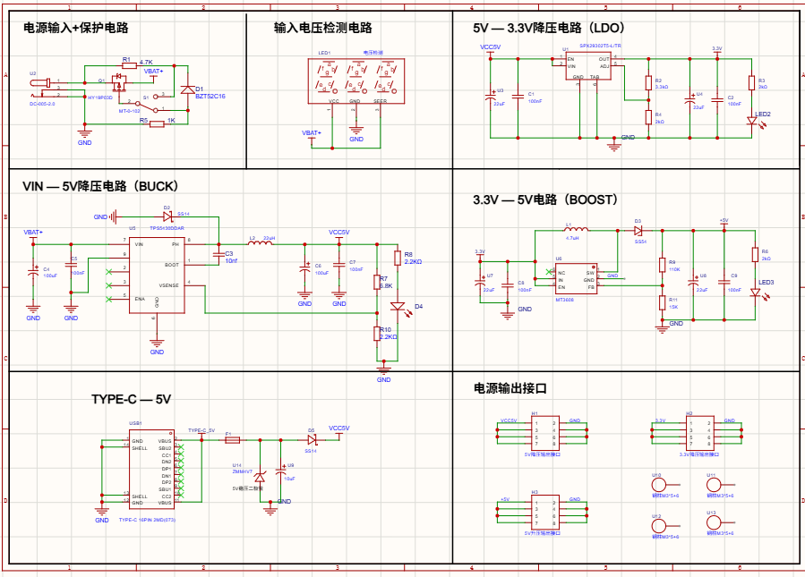
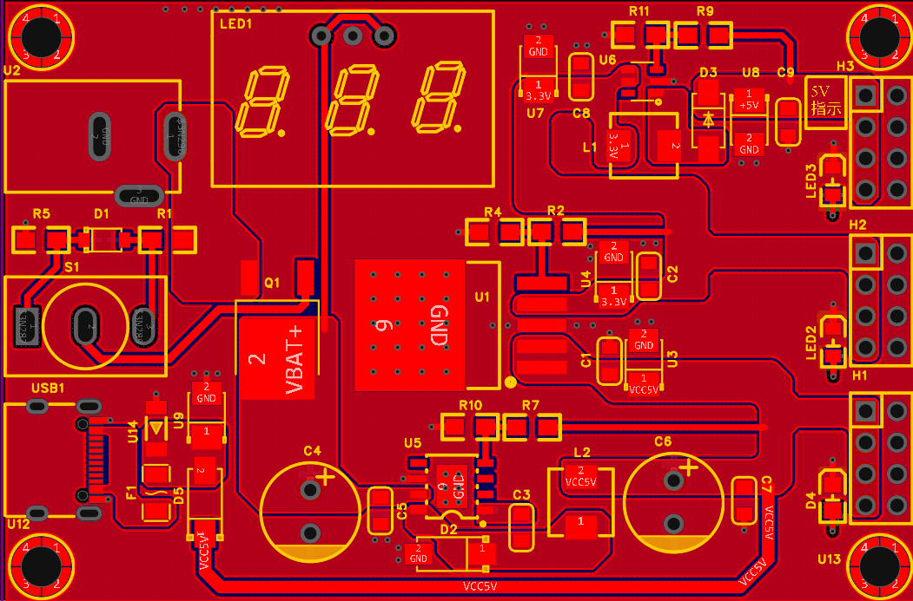

# 多拓扑直流电源模块设计

Type-C/DC 双输入通用电源模块，集成 Buck 降压、Boost 升压、LDO 稳压三种拓扑，提供多路稳定电压输出，可满足单片机、传感器、小型外设等不同负载的供电需求；板载输入电压显示。

> 说明：本项目仅实现输入电压显示，未使用 ADC 采样电路。

---

## 核心性能指标

| 拓扑类型  | 主控芯片 | 输入范围 | 输出规格 | 实测效率 | 输出纹波 |
| --------- | -------- | -------- | -------- | -------- | -------- |
| Buck 降压 | TPS5430  | 6-12V DC | 5V/2A    | ≥90%     | ≤50mV    |
| LDO 稳压  | SPX29302 | 5V DC    | 3.3V     | -        | -        |
| Boost 升压| MT3608   | 3.3V DC  | 5V       | -        | -        |

---

## 整体设计方案

### 系统架构

采用双输入架构，支持 Type-C 与直流座两种供电方式；输入级统一防护后分为三路独立拓扑，分别输出 5V、3.3V 等常用电压轨，各电路分区布局，便于测试与故障排查。

### 方案与选型

- Buck 降压：TPS5430，6-12V 输入转 5V 输出
- LDO 稳压：SPX29302，5V 转 3.3V
- Boost 升压：MT3608，3.3V 输入转 5V

### 核心设计亮点

- **双输入兼容**：支持 Type-C 与直流电源座两种输入方式，适配不同使用场景
- **三级输入保护**：设计 TVS 防浪涌、自恢复保险丝过流保护、防反接二极管，提升模块可靠性
- **高效率降压**：Buck 路采用降压架构，典型负载下转换效率稳定在 90% 以上
- **低纹波设计**：PCB 布局优化功率回路走线，减小寄生电感，输出纹波峰峰值控制在 50mV 以内
- **模块化布局**：三路拓扑独立分区，信号回路与功率回路物理分隔，降低相互干扰

---

## 硬件实现

- 采用 2 层 PCB 设计，使用立创EDA 完成原理图绘制与版图布线
- 完成全流程元器件选型、参数校核与 BOM 整理
- 独立完成电路板手工焊接、模块单独调试与整体联调

---

## 设计图纸展示

### 系统原理图

### PCB 布局图

---

## 测试与验证

使用示波器、电子负载、万用表完成全工况测试，覆盖轻载、半载、满载典型工况：

- Buck 电路在 5V/2A 满载条件下，转换效率实测达 90% 以上
- 输出电压纹波峰峰值 ≤50mV，满足数字电路供电要求
- 输入过流、反接、浪涌保护功能均验证有效

---

## 后续改进方向

- 优化 Buck 环路补偿参数，提升动态响应性能
- 增加 EMI 滤波电路，进一步降低传导干扰
- 增加输出电压可调功能，拓展应用场景
